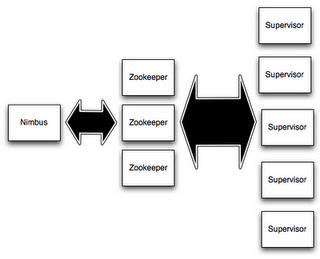

# Storm Manual

<!-- TOC depthFrom:1 depthTo:4 withLinks:1 updateOnSave:1 orderedList:0 -->

- [Storm Manual](#storm-manual)
	- [What is storm?](#what-is-storm)
	- [Components](#components)
		- [Nodes](#nodes)
			- [Nimbus](#nimbus)
			- [Supervisor](#supervisor)
			- [Worker process](#worker-process)
			- [Zookeeper](#zookeeper)
		- [Topologies](#topologies)
			- [Spout](#spout)
			- [Bolt](#bolt)
			- [Stream](#stream)

<!-- /TOC -->
## What is storm?
Apache Storm is a distributed real-time processing system that is horizontally scalable. It is fault-tolerant and can optionally guarantee the processing of messages. Last but not least it's open source and free.

Storm can run in 2 different modes:

###### Streaming
Messages will flow continuosly through the system

###### Batching (Trident)
Messages will be grouped and then processed in batchs, this is more or less how Spark-streaming (quite ironic the streaming in the name) works.

## Components
A storm cluster consists on several nodes that run a topology.

### Nodes

#### Nimbus
A nimbus service is run on the master node of the cluster. This service is responsible for distributing the topology around the cluster, balancing it and monitoring for failures.

#### Supervisor
The supervisor service is run on the worker nodes (it can be run on the master node too along with the nimbus) and is responsible for listening to work assigned to its machine and starting worker processes for it.

#### Worker process
A worker process runs a subset of the topology. In the practice this is a JVM (Java Virtual Machine) running an _"instance"_ of the topology. Since the topology can actually be run through several supervisor and worker processes at the same time.

#### Zookeeper
The zookeeper technically is not part of the storm cluster, but as so many big data technologies it's necessary to run it. The zookeeper cluster is used to coordinate the Nimbus and supervisor processes and it also contains their state[1](#pacemaker) since the services themshelves are stateless. This means that any of these services can be killed and restarted without impacting anything and also the supervisors can continue working normally even if the nimbus service is killed.

### Topologies
A topology is essentially a job that runs forever. This _job_ is a graph of stream transformations that is composed of **spouts**, **bolts** and **streams**.

#### Spout
The spouts are the sources of tuples of a topology. It can read from a queue, an API, or just produce a stream of random stuff. A topology needs to have at least 1 spout but can have up to n.

#### Bolt
The bolts subscribe to any number of streams and receive tuples from them, do some processing and optionally they can emit tuples to other streams.

#### Stream
The streams are composed of tuples and connect bolts with each other and with spouts.

---
<b id="pacemaker">1</b>: Starting with Storm 1.0 a pacemaker service can be run to process heartbeats from workers to avoid zookeeper from becoming a bottleneck when the storm cluster is scaled too much [↩](#a1)
